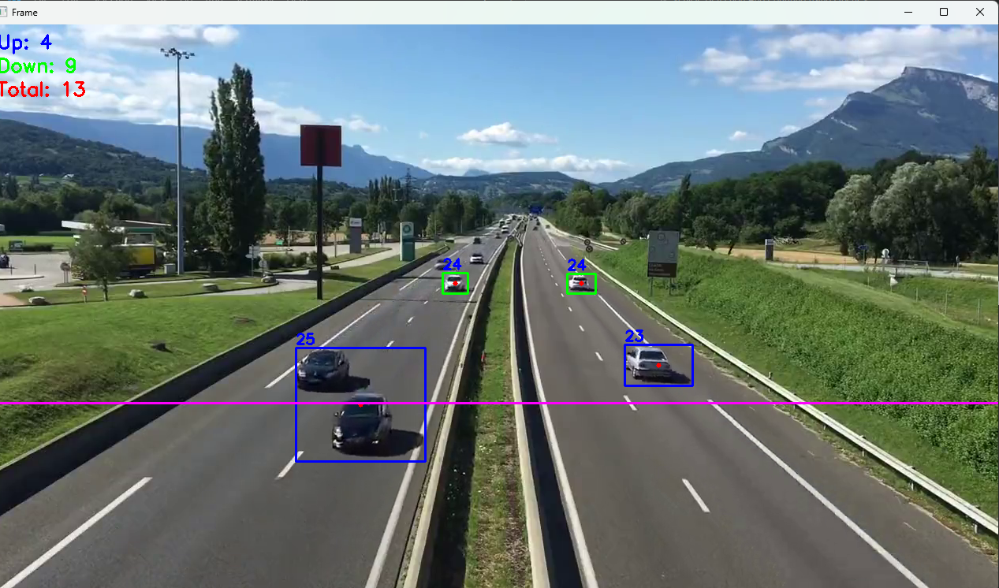

# 🚗 Vehicle Detection And Counting using OpenCV

This project is a **vehicle counting system** built with **Python** and **OpenCV**. It detects and counts vehicles in real-time from a video file or webcam feed using background subtraction and object tracking techniques.



## 🧠 Features

- Real-time vehicle detection and tracking  
- Automatic up/down direction counting  
- Works with both video files and live webcam feed  
- Background subtraction using MOG/MOG2  
- Noise reduction with morphological operations  
- Adjustable parameters (count line position, object size, etc.)  
- Displays total, up, and down counts in real-time  

## 🧩 Requirements

- Python 3.8 or later  
- OpenCV  
- NumPy  

Install dependencies with:
```bash
pip install opencv-python numpy
```

## 🚀 Usage

### From a video file
```bash
python vehicle_counter.py --video video.mp4 --count-line-position 300
```

### From a webcam
```bash
python vehicle_counter.py --camera
```

## ⚙️ Arguments

| Argument | Description | Default |
|-----------|--------------|----------|
| `--video` | Path to video file | `video.mp4` |
| `--camera` | Use webcam instead of video file | `False` |
| `--device` | Camera device index | `0` |
| `--count-line-position` | Y position of counting line | `2/3 of frame height` |
| `--min-width-react` | Minimum bounding box width | `80` |
| `--min-height-react` | Minimum bounding box height | `80` |

## 📊 Output Example

The system displays the processed video with bounding boxes, a counting line, and live vehicle counts:
- **Blue** → Vehicles moving up  
- **Orange** → Vehicles moving down  
- **Magenta** → Default detection state  

**Example output display:**  
```
Up: 3
Down: 5
Total: 8
```

## 🏁 Project Structure

```
├── vehicle_counter.py
├── video.mp4
├── screenshot.png
└── README.md
```

## 💡 Author

👤 **Shariful**  
🔗 [GitHub Profile](https://github.com/pythonicshariful)  

## 🏷️ Tags

`python` `opencv` `computer-vision` `vehicle-detection` `object-tracking` `traffic-analysis` `background-subtraction` `video-processing` `ai` `image-processing`

---
> 📸 Repository: [pythonicshariful/-Vehicle-Detection-And-Counting-using-OpenCV](https://github.com/pythonicshariful/-Vehicle-Detection-And-Counting-using-OpenCV)
